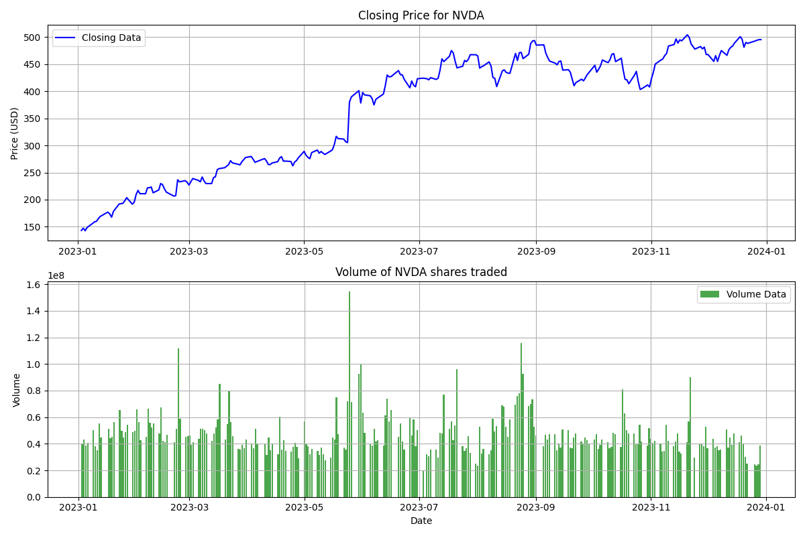

# Stock Data Visualization Tool

Data visualization tool for stock volume and closing prices. 

This tool provides an easy way to visualize stock data using Matplotlib, specifically closing price and trading volume. It allows users to select a date range and view the closing prices and volume of shares traded side-by side.

## Required
- Python 3.x
- Required libraries: pandas, matplotlib, pandas_datareader, yfinance

## Sample Output 
Below is a sample output looking at NVDA stock from the date ranges of 2023-01-01 to 2024-01-01.

